# Terragrunt Garland Challange
    This repo has code about garland's challange, following is a detail of the requirement.

## Requirements:
    Then this is a perfect technical test.  We are using Terragrunt here and you will have to learn that anyways.  This test is here to assess a few things:
    - How well you can pick up and learn a new tech
    - How well you can implement something new
    - How well you communicate
    
    The Task:
    Convert this to a terragrunt format:  https://github.com/ManagedKube/kubernetes-ops/blob/main/terraform-environments/aws/dev/25-eks-cluster-autoscaler/main.tf
    You can mock most of it out and i dont need actual working code but I do need something in the Terragrunt format that resembles a working config
    Leverage me if you have any further questions or you are stuck on something.  Ask questions here.  If no questions are asked, im assuming you understand everything and will be able to complete this task
    
    What im assessing this on:
      - If you understand the tech
      - If you can complete the task. 
      - Full completion of the task is not 100% necessary, im also looking for how you are able to unblock yourself and on tasks by either asking questions, leveraging other members in the team, or googling
      - That we can work in a remote fashion.  This means that we can communicate over Slack, huddle, zoom, etc.  That we can work in an async fashion where we both dont need to be online at the same time.  That you can coordinate and get time when we do need an in person meeting.
    
    What you should deliever:
    A file.  This file will be similar to the original one but in a Terragrunt format.  It will be similar to the length as well.
    Post it here

1. i got a fork or copy from file repo in terraform old format, you could see [here](/terragrunt_garland_challenge/terraform.old.format)

## Terragrunt 

Terragrunt is a thin wrapper that provides extra tools for keeping your configurations DRY, working with multiple Terraform modules, and managing remote state.
In summary Define Terraform code once, no matter how many environments you have.
 
source: https://terragrunt.gruntwork.io/

## What is the problem and the Solution?
In my own words, i consider that for create multiples enviroments as dev, qa and prod; when you are using terraform , you need to create once file for every enviroment. for example.
 
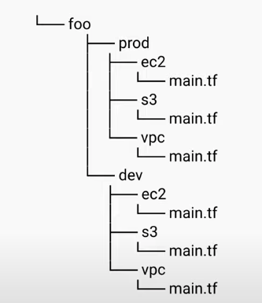
 
Terragrunt solves it. something like this
 
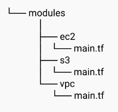

1. first, Install terragrunt (mac os)
   >➜ ✗ brew install terragrunt

2. In adition , i created an organization in my own account of terraform cloud with name managekube1 (managekube already exits)
 
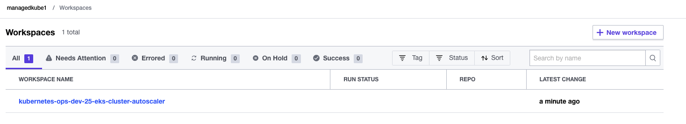

1. Futhermore, 
To understand how I could implement terragrunt, I first set up a traditional terraform cloud environment to validate that my traditional terraform files worked well; this being a set of folders each with its own main.tf; to ensure that the required file works correctly; I needed to connect 
with terraform cloud and aws credentials (personal account); from here it is evident the problem, it is necessary to configure workspaces previously and hardcode it, the environment variables are managed in a group for each workspace, so it is usually a headache.
In this step run each of the following resource groups

- route 53
  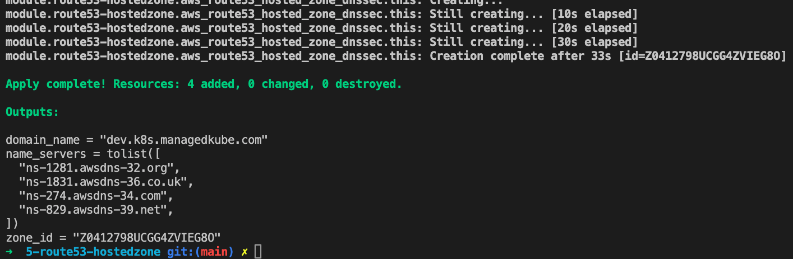
  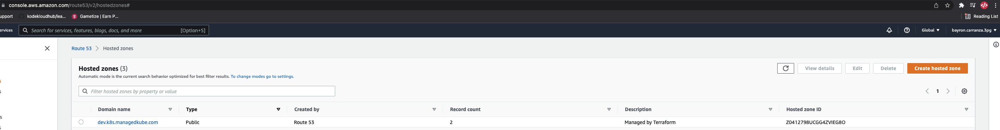
- vpc
  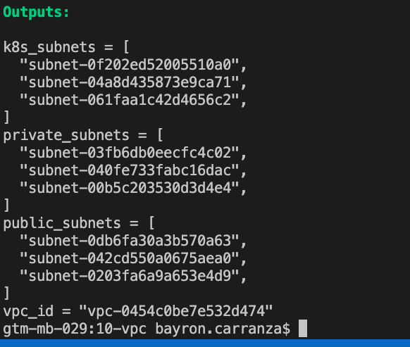
  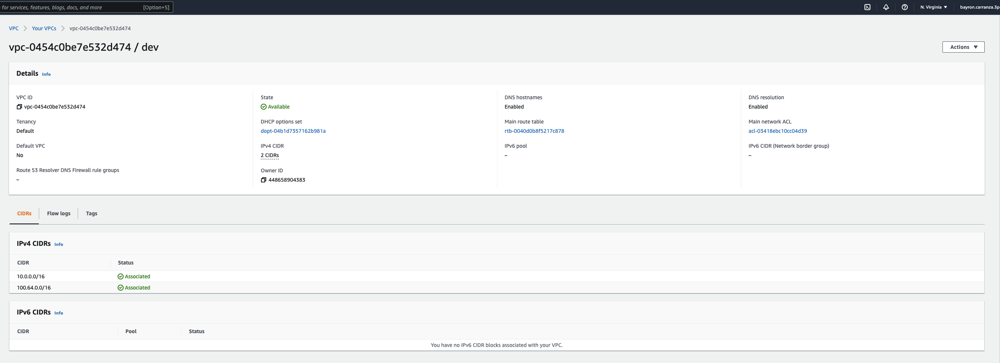
- eks
  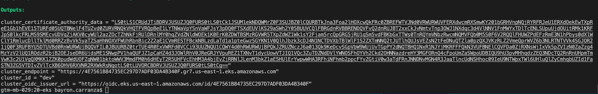
  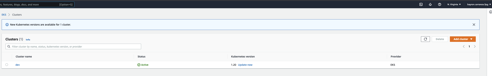
- eks autoscaler
  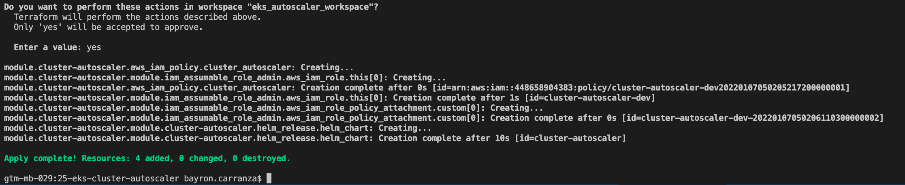
  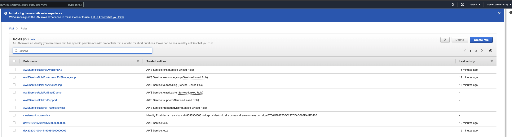

  in the right order, since there is resource dependency; resulting in successful states in terraform cloud
  

1. And finally, I implemented terragrunt (note: the repo given in the 
  requirement already had terragrunt implemented for the whole 
  solution, however I tried to do it on my own for the required file).
  But if it is necessary to indicate if I understood how it was implemented in original repo, you can contact me